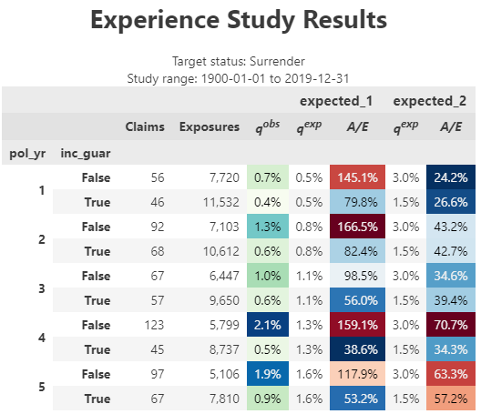

# actxps
<a href="https://github.com/mattheaphy/actxpspy/"></a>

<!-- README.md is generated from README.Rmd. Please edit that file -->

The actxps package provides a set of tools to assist with the creation
of actuarial experience studies. Experience studies are used by
actuaries to explore historical experience across blocks of business and
to inform assumption setting for projection models.

- The `ExposedDF` class converts census-level records into policy or
  calendar year exposure records.
- The `exp_stats()` method of `ExposedDF` creates `ExpStats` experience
  summary objects containing observed termination rates and claims.
  Optionally, expected termination rates, actual-to-expected ratios, and
  limited fluctuation credibility estimates can also be returned.
- The `add_transactions()` method of `ExposedDF` attaches summarized
  transactions to an `ExposedDF` object.
- The `trx_stats()` method of `ExposedDF` creates `TrxStats` transaction
  summary objects containing transaction counts, amounts, frequencies,
  and utilization. Optionally, transaction amounts can be expressed as a
  percentage of one or more variables to calculate rates or
  actual-to-expected ratios.
- The `plot()` and `table()` methods of `ExpStats` and `TrxStats` create
  plots and tables for reporting.
- The `exp_shiny()` method of `ExposedDF` launches a Shiny app that
  allows for interactive exploration of experience drivers.

## Installation

The actxps package can be installed from PyPI with:

    $ pip install actxps

## Basic usage

An expanded version of this demo is available at [Getting started with
actxps](https://mattheaphy.github.io/actxpspy/articles/actxps.html).

The actxps package includes simulated census data for a theoretical
deferred annuity product with an optional guaranteed income rider. The
grain of this data is one row *per policy*.

``` python
import actxps as xp
import numpy as np
import polars as pl

census_dat = xp.load_census_dat()
print(census_dat)
```

    shape: (20_000, 11)
    ┌─────────┬───────────┬────────────┬──────────┬───┬────────┬────────┬─────────┬────────────┐
    │ pol_num ┆ status    ┆ issue_date ┆ inc_guar ┆ … ┆ gender ┆ wd_age ┆ premium ┆ term_date  │
    │ ---     ┆ ---       ┆ ---        ┆ ---      ┆   ┆ ---    ┆ ---    ┆ ---     ┆ ---        │
    │ i64     ┆ cat       ┆ date       ┆ bool     ┆   ┆ cat    ┆ i64    ┆ f64     ┆ date       │
    ╞═════════╪═══════════╪════════════╪══════════╪═══╪════════╪════════╪═════════╪════════════╡
    │ 1       ┆ Active    ┆ 2014-12-17 ┆ true     ┆ … ┆ F      ┆ 77     ┆ 370.0   ┆ null       │
    │ 2       ┆ Surrender ┆ 2007-09-24 ┆ false    ┆ … ┆ F      ┆ 71     ┆ 708.0   ┆ 2019-03-08 │
    │ 3       ┆ Active    ┆ 2012-10-06 ┆ false    ┆ … ┆ F      ┆ 63     ┆ 466.0   ┆ null       │
    │ 4       ┆ Surrender ┆ 2005-06-27 ┆ true     ┆ … ┆ M      ┆ 62     ┆ 485.0   ┆ 2018-11-29 │
    │ 5       ┆ Active    ┆ 2019-11-22 ┆ false    ┆ … ┆ F      ┆ 67     ┆ 978.0   ┆ null       │
    │ …       ┆ …         ┆ …          ┆ …        ┆ … ┆ …      ┆ …      ┆ …       ┆ …          │
    │ 19996   ┆ Active    ┆ 2014-08-11 ┆ true     ┆ … ┆ F      ┆ 75     ┆ 3551.0  ┆ null       │
    │ 19997   ┆ Surrender ┆ 2006-11-20 ┆ false    ┆ … ┆ F      ┆ 77     ┆ 336.0   ┆ 2017-07-09 │
    │ 19998   ┆ Surrender ┆ 2017-02-20 ┆ true     ┆ … ┆ F      ┆ 68     ┆ 1222.0  ┆ 2018-08-03 │
    │ 19999   ┆ Active    ┆ 2015-04-11 ┆ false    ┆ … ┆ M      ┆ 78     ┆ 2138.0  ┆ null       │
    │ 20000   ┆ Active    ┆ 2009-04-29 ┆ true     ┆ … ┆ M      ┆ 72     ┆ 5751.0  ┆ null       │
    └─────────┴───────────┴────────────┴──────────┴───┴────────┴────────┴─────────┴────────────┘

Convert census records to exposure records with one row *per policy per
year*.

``` python
exposed_data = xp.ExposedDF(census_dat,
                            end_date="2019-12-31",
                            target_status="Surrender")

exposed_data
```

    Exposure data

    Exposure type: policy_year
    Target status: Surrender
    Study range: 1900-01-01 to 2019-12-31

    shape: (141_252, 15)
    ┌─────────┬────────┬────────────┬──────────┬───┬────────┬─────────────┬─────────────────┬──────────┐
    │ pol_num ┆ status ┆ issue_date ┆ inc_guar ┆ … ┆ pol_yr ┆ pol_date_yr ┆ pol_date_yr_end ┆ exposure │
    │ ---     ┆ ---    ┆ ---        ┆ ---      ┆   ┆ ---    ┆ ---         ┆ ---             ┆ ---      │
    │ i64     ┆ enum   ┆ date       ┆ bool     ┆   ┆ u32    ┆ date        ┆ date            ┆ f64      │
    ╞═════════╪════════╪════════════╪══════════╪═══╪════════╪═════════════╪═════════════════╪══════════╡
    │ 1       ┆ Active ┆ 2014-12-17 ┆ true     ┆ … ┆ 1      ┆ 2014-12-17  ┆ 2015-12-16      ┆ 1.0      │
    │ 1       ┆ Active ┆ 2014-12-17 ┆ true     ┆ … ┆ 2      ┆ 2015-12-17  ┆ 2016-12-16      ┆ 1.0      │
    │ 1       ┆ Active ┆ 2014-12-17 ┆ true     ┆ … ┆ 3      ┆ 2016-12-17  ┆ 2017-12-16      ┆ 1.0      │
    │ 1       ┆ Active ┆ 2014-12-17 ┆ true     ┆ … ┆ 4      ┆ 2017-12-17  ┆ 2018-12-16      ┆ 1.0      │
    │ 1       ┆ Active ┆ 2014-12-17 ┆ true     ┆ … ┆ 5      ┆ 2018-12-17  ┆ 2019-12-16      ┆ 1.0      │
    │ …       ┆ …      ┆ …          ┆ …        ┆ … ┆ …      ┆ …           ┆ …               ┆ …        │
    │ 20000   ┆ Active ┆ 2009-04-29 ┆ true     ┆ … ┆ 7      ┆ 2015-04-29  ┆ 2016-04-28      ┆ 1.0      │
    │ 20000   ┆ Active ┆ 2009-04-29 ┆ true     ┆ … ┆ 8      ┆ 2016-04-29  ┆ 2017-04-28      ┆ 1.0      │
    │ 20000   ┆ Active ┆ 2009-04-29 ┆ true     ┆ … ┆ 9      ┆ 2017-04-29  ┆ 2018-04-28      ┆ 1.0      │
    │ 20000   ┆ Active ┆ 2009-04-29 ┆ true     ┆ … ┆ 10     ┆ 2018-04-29  ┆ 2019-04-28      ┆ 1.0      │
    │ 20000   ┆ Active ┆ 2009-04-29 ┆ true     ┆ … ┆ 11     ┆ 2019-04-29  ┆ 2020-04-28      ┆ 0.674863 │
    └─────────┴────────┴────────────┴──────────┴───┴────────┴─────────────┴─────────────────┴──────────┘

Create a summary grouped by policy year and the presence of a guaranteed
income rider.

``` python
exp_res = (exposed_data.
           group_by('pol_yr', 'inc_guar').
           exp_stats())

exp_res
```

    Experience study results

    Groups: pol_yr, inc_guar
    Target status: Surrender
    Study range: 1900-01-01 to 2019-12-31

    shape: (30, 6)
    ┌────────┬──────────┬──────────┬────────┬──────────────┬──────────┐
    │ pol_yr ┆ inc_guar ┆ n_claims ┆ claims ┆ exposure     ┆ q_obs    │
    │ ---    ┆ ---      ┆ ---      ┆ ---    ┆ ---          ┆ ---      │
    │ u32    ┆ bool     ┆ u32      ┆ u32    ┆ f64          ┆ f64      │
    ╞════════╪══════════╪══════════╪════════╪══════════════╪══════════╡
    │ 1      ┆ false    ┆ 56       ┆ 56     ┆ 7719.80774   ┆ 0.007254 │
    │ 1      ┆ true     ┆ 46       ┆ 46     ┆ 11532.404626 ┆ 0.003989 │
    │ 2      ┆ false    ┆ 92       ┆ 92     ┆ 7102.81316   ┆ 0.012953 │
    │ 2      ┆ true     ┆ 68       ┆ 68     ┆ 10611.967258 ┆ 0.006408 │
    │ 3      ┆ false    ┆ 67       ┆ 67     ┆ 6446.916146  ┆ 0.010393 │
    │ …      ┆ …        ┆ …        ┆ …      ┆ …            ┆ …        │
    │ 13     ┆ true     ┆ 49       ┆ 49     ┆ 1117.137361  ┆ 0.043862 │
    │ 14     ┆ false    ┆ 33       ┆ 33     ┆ 262.622262   ┆ 0.125656 │
    │ 14     ┆ true     ┆ 29       ┆ 29     ┆ 609.216476   ┆ 0.047602 │
    │ 15     ┆ false    ┆ 8        ┆ 8      ┆ 74.050109    ┆ 0.108035 │
    │ 15     ┆ true     ┆ 9        ┆ 9      ┆ 194.128602   ┆ 0.046361 │
    └────────┴──────────┴──────────┴────────┴──────────────┴──────────┘

Calculate actual-to-expected ratios.

First, attach one or more columns of expected termination rates to the
exposure data. Then, pass these column names to the `expected` argument
of `exp_stats()`.

``` python
expected_table = np.concatenate((
    np.linspace(0.005, 0.03, 10), 
    np.array([0.2, 0.15]), 
    np.repeat(0.05, 3)
    ))

# using 2 different expected termination rates
exposed_data.data = exposed_data.data.with_columns(
    expected_1=expected_table[exposed_data.data['pol_yr'] - 1],
    expected_2=pl.when(pl.col('inc_guar')).then(0.015).otherwise(0.03)
)

exp_res = (exposed_data.
           group_by('pol_yr', 'inc_guar').
           exp_stats(expected = ["expected_1", "expected_2"]))

exp_res
```

    Experience study results

    Groups: pol_yr, inc_guar
    Target status: Surrender
    Study range: 1900-01-01 to 2019-12-31
    Expected values: expected_1, expected_2

    shape: (30, 10)
    ┌────────┬──────────┬──────────┬────────┬───┬────────────┬────────────┬──────────────┬─────────────┐
    │ pol_yr ┆ inc_guar ┆ n_claims ┆ claims ┆ … ┆ expected_1 ┆ expected_2 ┆ ae_expected_ ┆ ae_expected │
    │ ---    ┆ ---      ┆ ---      ┆ ---    ┆   ┆ ---        ┆ ---        ┆ 1            ┆ _2          │
    │ u32    ┆ bool     ┆ u32      ┆ u32    ┆   ┆ f64        ┆ f64        ┆ ---          ┆ ---         │
    │        ┆          ┆          ┆        ┆   ┆            ┆            ┆ f64          ┆ f64         │
    ╞════════╪══════════╪══════════╪════════╪═══╪════════════╪════════════╪══════════════╪═════════════╡
    │ 1      ┆ false    ┆ 56       ┆ 56     ┆ … ┆ 0.005      ┆ 0.03       ┆ 1.450813     ┆ 0.241802    │
    │ 1      ┆ true     ┆ 46       ┆ 46     ┆ … ┆ 0.005      ┆ 0.015      ┆ 0.797752     ┆ 0.265917    │
    │ 2      ┆ false    ┆ 92       ┆ 92     ┆ … ┆ 0.007778   ┆ 0.03       ┆ 1.665336     ┆ 0.431754    │
    │ 2      ┆ true     ┆ 68       ┆ 68     ┆ … ┆ 0.007778   ┆ 0.015      ┆ 0.823868     ┆ 0.427191    │
    │ 3      ┆ false    ┆ 67       ┆ 67     ┆ … ┆ 0.010556   ┆ 0.03       ┆ 0.984559     ┆ 0.346419    │
    │ …      ┆ …        ┆ …        ┆ …      ┆ … ┆ …          ┆ …          ┆ …            ┆ …           │
    │ 13     ┆ true     ┆ 49       ┆ 49     ┆ … ┆ 0.05       ┆ 0.015      ┆ 0.877242     ┆ 2.924141    │
    │ 14     ┆ false    ┆ 33       ┆ 33     ┆ … ┆ 0.05       ┆ 0.03       ┆ 2.513115     ┆ 4.188525    │
    │ 14     ┆ true     ┆ 29       ┆ 29     ┆ … ┆ 0.05       ┆ 0.015      ┆ 0.952043     ┆ 3.173475    │
    │ 15     ┆ false    ┆ 8        ┆ 8      ┆ … ┆ 0.05       ┆ 0.03       ┆ 2.160699     ┆ 3.601165    │
    │ 15     ┆ true     ┆ 9        ┆ 9      ┆ … ┆ 0.05       ┆ 0.015      ┆ 0.92722      ┆ 3.090735    │
    └────────┴──────────┴──────────┴────────┴───┴────────────┴────────────┴──────────────┴─────────────┘

Create visualizations using the `plot()` and `table()` methods.

``` python
exp_res.plot()
```


    <Figure Size: (640 x 480)>

``` python
# first 10 rows showed for brevity
exp_res.table()
```

<center>

</center>

Launch a shiny app to interactively explore experience data.

``` python
exposed_data.exp_shiny()
```


<br> **Logo**

<a href="https://www.freepik.com/free-vector/shine-old-wooden-chest-realistic-composition-transparent-background-with-vintage-coffer-sparkling-particles_7497397.htm#query=treasure&position=7&from_view=search&track=sph">Image
by macrovector</a> on Freepik
