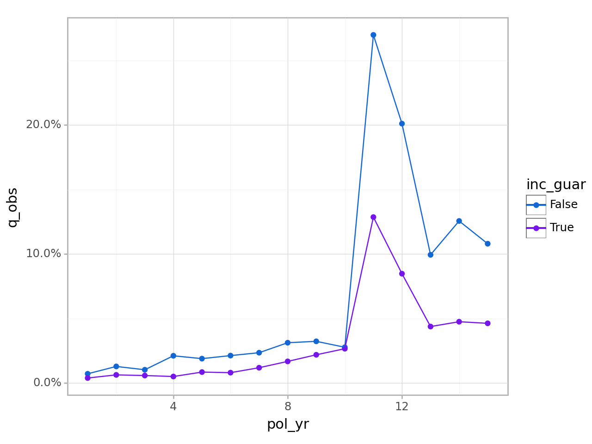

# actxps
<a href="https://github.com/mattheaphy/actxpspy/"></a>

<!-- README.md is generated from README.Rmd. Please edit that file -->

The actxps package provides a set of tools to assist with the creation
of actuarial experience studies. Experience studies are used by
actuaries to explore historical experience across blocks of business and
to inform assumption setting for projection models.

- The `ExposedDF` class converts census-level records into policy or
  calendar year exposure records.
- The `exp_stats()` method of `ExposedDF` creates `ExpStats` experience
  summary objects containing observed termination rates and claims.
  Optionally, expected termination rates, actual-to-expected ratios, and
  limited fluctuation credibility estimates can also be returned.
- The `add_transactions()` method of `ExposedDF` attaches summarized
  transactions to an `ExposedDF` object.
- The `trx_stats()` method of `ExposedDF` creates `TrxStats` transaction
  summary objects containing transaction counts, amounts, frequencies,
  and utilization. Optionally, transaction amounts can be expressed as a
  percentage of one or more variables to calculate rates or
  actual-to-expected ratios.
- The `plot()` and `table()` methods of `ExpStats` and `TrxStats` create
  plots and tables for reporting.
- The `exp_shiny()` method of `ExposedDF` launches a Shiny app that
  allows for interactive exploration of experience drivers.

## Basic usage

An expanded version of this demo is available at [Getting started with
actxps](https://mattheaphy.github.io/actxpspy/articles/actxps.html).

The actxps package includes simulated census data for a theoretical
deferred annuity product with an optional guaranteed income rider. The
grain of this data is one row *per policy*.

``` python
import actxps as xp
import numpy as np

census_dat = xp.load_census_dat()
print(census_dat)
```

           pol_num     status issue_date  inc_guar   qual  age product gender  \
    0            1     Active 2014-12-17      True  False   56       b      F   
    1            2  Surrender 2007-09-24     False  False   71       a      F   
    2            3     Active 2012-10-06     False   True   62       b      F   
    3            4  Surrender 2005-06-27      True   True   62       c      M   
    4            5     Active 2019-11-22     False  False   62       c      F   
    ...        ...        ...        ...       ...    ...  ...     ...    ...   
    19995    19996     Active 2014-08-11      True   True   55       b      F   
    19996    19997  Surrender 2006-11-20     False  False   68       c      F   
    19997    19998  Surrender 2017-02-20      True  False   68       c      F   
    19998    19999     Active 2015-04-11     False   True   67       a      M   
    19999    20000     Active 2009-04-29      True   True   72       c      M   

           wd_age  premium  term_date  
    0          77    370.0        NaT  
    1          71    708.0 2019-03-08  
    2          63    466.0        NaT  
    3          62    485.0 2018-11-29  
    4          67    978.0        NaT  
    ...       ...      ...        ...  
    19995      75   3551.0        NaT  
    19996      77    336.0 2017-07-09  
    19997      68   1222.0 2018-08-03  
    19998      78   2138.0        NaT  
    19999      72   5751.0        NaT  

    [20000 rows x 11 columns]

Convert census records to exposure records with one row *per policy per
year*.

``` python
exposed_data = xp.ExposedDF(census_dat,
                            end_date="2019-12-31",
                            target_status="Surrender")

exposed_data
```

    Exposure data

    Exposure type: policy_year
    Target status: Surrender
    Study range: 1900-01-01 to 2019-12-31

    A DataFrame: 141,252 x 15
       pol_num  status issue_date  inc_guar   qual  age product gender  wd_age  \
    0        1  Active 2014-12-17      True  False   56       b      F      77   
    1        1  Active 2014-12-17      True  False   56       b      F      77   
    2        1  Active 2014-12-17      True  False   56       b      F      77   
    3        1  Active 2014-12-17      True  False   56       b      F      77   
    4        1  Active 2014-12-17      True  False   56       b      F      77   
    5        1  Active 2014-12-17      True  False   56       b      F      77   
    6        2  Active 2007-09-24     False  False   71       a      F      71   
    7        2  Active 2007-09-24     False  False   71       a      F      71   
    8        2  Active 2007-09-24     False  False   71       a      F      71   
    9        2  Active 2007-09-24     False  False   71       a      F      71   

       premium term_date  pol_yr pol_date_yr pol_date_yr_end  exposure  
    0    370.0       NaT       1  2014-12-17      2015-12-16  1.000000  
    1    370.0       NaT       2  2015-12-17      2016-12-16  1.000000  
    2    370.0       NaT       3  2016-12-17      2017-12-16  1.000000  
    3    370.0       NaT       4  2017-12-17      2018-12-16  1.000000  
    4    370.0       NaT       5  2018-12-17      2019-12-16  1.000000  
    5    370.0       NaT       6  2019-12-17      2020-12-16  0.040984  
    6    708.0       NaT       1  2007-09-24      2008-09-23  1.000000  
    7    708.0       NaT       2  2008-09-24      2009-09-23  1.000000  
    8    708.0       NaT       3  2009-09-24      2010-09-23  1.000000  
    9    708.0       NaT       4  2010-09-24      2011-09-23  1.000000  

Create a summary grouped by policy year and the presence of a guaranteed
income rider.

``` python
exp_res = (exposed_data.
           group_by('pol_yr', 'inc_guar').
           exp_stats())

exp_res
```

    Experience study results

    Groups: pol_yr, inc_guar
    Target status: Surrender
    Study range: 1900-01-01 to 2019-12-31


    A DataFrame: 30 x 6
       pol_yr  inc_guar  n_claims  claims      exposure     q_obs
    0       1     False        56      56   7719.807740  0.007254
    1       1      True        46      46  11532.404626  0.003989
    2       2     False        92      92   7102.813160  0.012953
    3       2      True        68      68  10611.967258  0.006408
    4       3     False        67      67   6446.916146  0.010393
    5       3      True        57      57   9650.221229  0.005907
    6       4     False       123     123   5798.909986  0.021211
    7       4      True        45      45   8736.954420  0.005151
    8       5     False        97      97   5105.875799  0.018998
    9       5      True        67      67   7809.650445  0.008579

Calculate actual-to-expected ratios.

First, attach one or more columns of expected termination rates to the
exposure data. Then, pass these column names to the `expected` argument
of `exp_stats()`.

``` python
expected_table = np.concatenate((
    np.linspace(0.005, 0.03, 10), 
    np.array([0.2, 0.15]), 
    np.repeat(0.05, 3)
    ))

# using 2 different expected termination rates
exposed_data.data['expected_1'] = \
    expected_table[exposed_data.data.pol_yr - 1]
exposed_data.data['expected_2'] = \
    np.where(exposed_data.data.inc_guar, 0.015, 0.03)

exp_res = (exposed_data.
           group_by('pol_yr', 'inc_guar').
           exp_stats(expected = ["expected_1", "expected_2"]))

exp_res
```

    Experience study results

    Groups: pol_yr, inc_guar
    Target status: Surrender
    Study range: 1900-01-01 to 2019-12-31
    Expected values: expected_1, expected_2


    A DataFrame: 30 x 10
       pol_yr  inc_guar  n_claims  claims      exposure     q_obs  expected_1  \
    0       1     False        56      56   7719.807740  0.007254    0.005000   
    1       1      True        46      46  11532.404626  0.003989    0.005000   
    2       2     False        92      92   7102.813160  0.012953    0.007778   
    3       2      True        68      68  10611.967258  0.006408    0.007778   
    4       3     False        67      67   6446.916146  0.010393    0.010556   
    5       3      True        57      57   9650.221229  0.005907    0.010556   
    6       4     False       123     123   5798.909986  0.021211    0.013333   
    7       4      True        45      45   8736.954420  0.005151    0.013333   
    8       5     False        97      97   5105.875799  0.018998    0.016111   
    9       5      True        67      67   7809.650445  0.008579    0.016111   

       expected_2  ae_expected_1  ae_expected_2  
    0       0.030       1.450813       0.241802  
    1       0.015       0.797752       0.265917  
    2       0.030       1.665336       0.431754  
    3       0.015       0.823868       0.427191  
    4       0.030       0.984559       0.346419  
    5       0.015       0.559573       0.393773  
    6       0.030       1.590816       0.707029  
    7       0.015       0.386290       0.343369  
    8       0.030       1.179169       0.633257  
    9       0.015       0.532498       0.571942  

Create visualizations using the `plot()` and `table()` methods.

``` python
print(exp_res.plot())
```



``` python
# first 10 rows showed for brevity
exp_res.table()
```

<center>

</center>

Launch a shiny app to interactively explore experience data.

``` python
exposed_data.exp_shiny()
```


<br> **Logo**

<a href="https://www.freepik.com/free-vector/shine-old-wooden-chest-realistic-composition-transparent-background-with-vintage-coffer-sparkling-particles_7497397.htm#query=treasure&position=7&from_view=search&track=sph">Image
by macrovector</a> on Freepik
